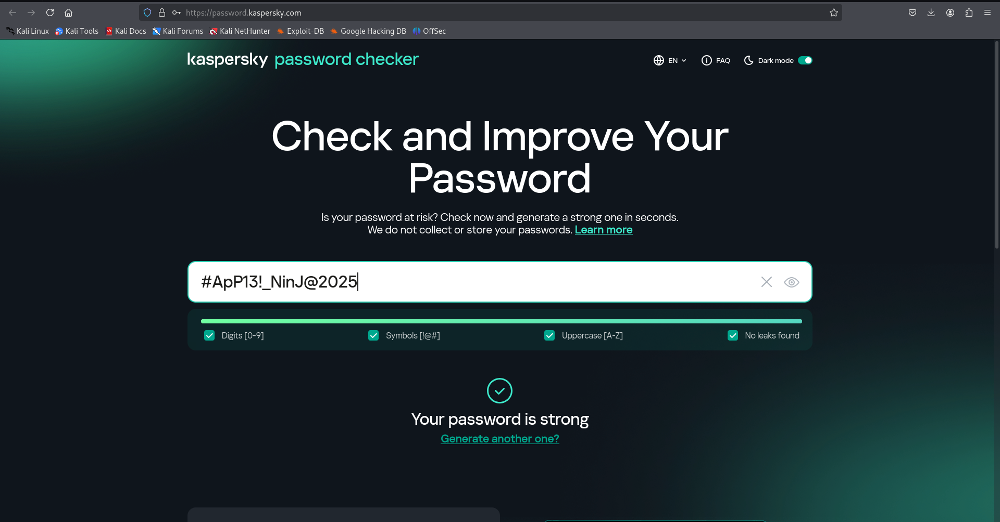

#  Task 6 – Password Strength Analysis

##  Overview
This task demonstrates password strength evaluation using **Kaspersky Password Checker**.  
Three different passwords were tested — weak, medium, and strong — to understand how password complexity impacts security.  
The analysis also covers best practices for creating strong passwords and common password attack methods.

---

##  Screenshots

### 1️ Weak Password

**Feedback:**  
- Password appeared in **leaked password databases**.  
- Lacks sufficient length and complexity.  
- Vulnerable to **dictionary attacks** and **brute force attacks**.

---

### 2️ Medium Password

**Feedback:**  
- Better than the weak password, but still appeared in leaked databases.  
- Includes symbols and numbers, but lacks sufficient length and randomness.  
- Could be cracked with **brute force** in a reasonable time.

---
### 3️⃣ Strong Password

**Feedback:**  
- No leaks found.  
- Contains **uppercase, lowercase, numbers, and special characters**.  
- Sufficient length makes it highly resistant to common password attacks.

---

## Best Practices for Creating Strong Passwords
1. Use at least **12–16 characters**.
2. Mix **uppercase, lowercase, numbers, and special characters**.
3. Avoid dictionary words or predictable patterns.
4. Never reuse passwords across accounts.
5. Consider using a **password manager** to store and generate passwords.
6. Change passwords periodically, especially after a breach.

---

##  Common Password Attacks
- **Brute Force Attack:** Tries all possible combinations until the correct one is found.  
- **Dictionary Attack:** Uses a list of common words and leaked passwords to guess quickly.  
- **Credential Stuffing:** Uses previously leaked username-password pairs to access accounts.

---

##  How Password Complexity Affects Security
- **Short, simple passwords** can be cracked in seconds or minutes.
- **Complex passwords** with randomness and sufficient length can take **years** or even **centuries** to crack.
- Passwords not found in leaked databases are much harder to guess.

---

🔹 Author: Mohammad Farhan Hussain
🔹 Internship: Elevate Labs Cybersecurity Internship
🔹 Tools: Kasperkey password checker

